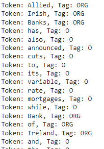

# BiGCAT 

Install Dependencies and Create an Environment
```python
pip install -r requirements.txt
pip install pyg-lib torch-scatter torch-sparse -f https://data.pyg.org/whl/torch-1.12.1+cu102.html
pip install torch-geometric
```
Load the pretrained model for FiNER-ORD dataset from Huggingface: 
```python
from models3 import GnnerAT, GnnerCONV
labels = ['PER','LOC','ORG']
model_name='philschmid/distilroberta-base-ner-conll2003'
max_span_width=8
width_embedding_dim=128
project_dim=256

model = GnnerCONV.from_pretrained("mrx71/BiGCAT", 
                                           labels=labels,
                                           model_name=model_name,
                                           max_span_width=max_span_width,
                                           width_embedding_dim=width_embedding_dim, 
                                           project_dim=project_dim,
                                          )
```
Get Prediction:
```python
from predict import *
import pandas as pd

model.eval()
load_test_df = pd.read_pickle("finer_test_data3.pkl")
prediction = predict_ner(load_test_df.token.values[:5],model)
final_pred = map_to_entity_labels(list(prediction))
# Display the entities with tags
display_entities_with_tags(load_test_df.token.values[:5], final_pred)
```


If you want to finetuning the BiGCAT model run the following command:
Here exEcute, "run3.py" for FiNER-ORD dataset and "run4.py" for FIN dataset
```python
python run3.py --model_name=philschmid/distilroberta-base-ner-conll2003 --epoch=25 --batch=16 --lr=2.3e-5 --max_span=8 --emb_width=128 --project_dim=256
```
